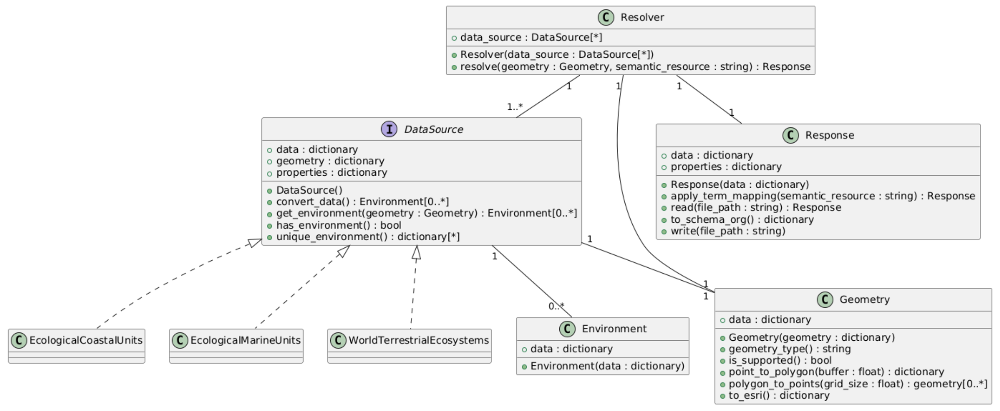

.. _design:

Project Design
==============

Welcome to the design document for `geoenvo`. This document provides an in-depth overview of the architectural design, key components, and design principles behind our work. It aims to enhance your understanding of our project's design philosophy and empower you to contribute effectively.

We encourage you to explore this document and reach out with any questions or suggestions. Your feedback is invaluable as we continuously improve and evolve our project.

Overview
--------

The goal of this project is to unify diverse, heterogeneous datasets
through a shared environmental context, supporting global dataset
integration and collaboration. To achieve this, we have established a
set of functional and non-functional design requirements.

Design Requirements
-------------------

**Functional Requirements**

-  Resolve geographic locations to detailed environmental descriptions.
-  Support widely used, high-value data sources relevant to this goal.
-  Provide an API that enables efficient iteration over large numbers of
   geometries.
-  Allow dynamic selection of data sources based on domains of interest.
-  Link location identifiers to results for recall and alignment.

**Interoperability Requirements**

-  Implement using open and widely adopted standards.
-  Map environmental descriptions to multiple ontologies and vocabularies.
-  Represent response data using Schema.org conventions.

**Efficiency Goals**

-  Cache results to prevent redundant queries.
-  Locally cache data sources whenever possible to improve query
   efficiency.
-  Avoid querying data sources when the geometry falls outside their
   supported bounds.

**Sustainability Goals**

-  Support extensibility for new data sources through new
   implementations of the ``DataSource`` ABC class.
-  Establish the project as a long-term, well-maintained community
   effort.

Implementation and Architecture
--------------------------------

This project is structured around a set of classes that encapsulate
distinct components of the geometry-to-environment process. Each class
defines properties and behaviors necessary to interact within the
system.

**Resolver**

The ``Resolver`` class serves as the primary client-facing API. Clients
configure the resolver with one or more ``DataSource`` instances to
query. The ``resolve`` method iterates through the selected data sources
using a defined ``Geometry``, compiles a list of returned
``Environment`` objects, maps them to the Environmental Ontology (ENVO)
by default, and returns a ``Response``.

**Response**

The ``Response`` class structures the results returned by the
``Resolver`` according to the response data model. The data model is
formatted as a GeoJSON Geometry Object with the ``properties`` field
containing the resolved environments and their descriptions. See the
Data Model section for a full description [link].

Methods of the ``Response`` class enable working with the response
content, including:

-  Mapping environments and their descriptions to different
   ontologies/vocabularies.
-  Transformation of the response into a Schema.org-compliant format,
   aligned with `Science-On-Schema.Org`_ conventions.
-  Writing/reading of data for storage or further processing.

.. _Science-On-Schema.Org: https://github.com/ESIPFed/science-on-schema.org/

**DataSource and Implementations**

The ``DataSource`` class is an abstract base class (ABC) that concrete
implementations extend. Each ``DataSource`` adheres to standardized
properties and methods for interoperability while supporting custom
functionality as needed.

Implementations must support the geometry types defined in the
``Geometry`` class, either directly or through approximations (e.g.,
querying representative points for a polygon if the data source does not
support polygon queries). In such cases, the data source documentation
should clearly explain this behavior and provide options to control it.

A ``DataSource`` returns an ``Environment`` object containing the
retrieved environmental descriptions.

**Environment**

The ``Environment`` class encapsulates environment descriptions returned
by a ``DataSource``. It undergoes minimal processing, ensuring that only
the relevant descriptions are retained.

**Geometry**

The ``Geometry`` class manages client-supplied geometries in GeoJSON
format and provides utility methods for data sources to process
geometries according to their specific requirements. Features include:

-  Identifying geometry types.
-  Converting point locations into polygons based on client parameters.
-  Transforming geometries into formats required by data sources (e.g.,
   ``to_esri``).

Currently, the ``Geometry`` class only supports GeoJSON ``Point`` and
``Polygon`` types, with plans to support additional types, including
``GeometryCollections``, in the future.

Semantic Mapping
----------------

This project uses the `Simple Standard for Sharing Ontological Mappings`_
(SSSOM) to facilitate semantic mapping between ``DataSource``
terminologies and adopted ontologies/vocabularies. Semantic mapping is
implemented in the ``apply_term_mapping`` method of the ``Response``
class.

.. _Simple Standard for Sharing Ontological Mappings: https://mapping-commons.github.io/sssom/

Error Handling
--------------

Error handling will be implemented to ensure the package operates
robustly and provides clear feedback to users. The strategy focuses on
distinguishing between expected errors (e.g., invalid geometries,
unsupported data sources) and unexpected failures (e.g., network
outages, internal bugs).

**Error Classes**

Custom error classes will be introduced to categorize and handle errors
consistently:

-  ``GeometryError``: Raised when an invalid or unsupported geometry
   is provided to the ``Geometry`` class.
-  ``DataSourceError``: Raised for issues specific to a
   ``DataSource`` (e.g., missing required parameters, unsupported query
   types).
-  ``ResolutionError``: Raised by the ``Resolver`` when a query
   cannot be processed due to conflicts between geometries and data
   sources.
-  ``TermMappingError``: Raised when a mapping between data source
   terms and ontologies/vocabularies fails or an expected mapping file
   is missing or malformed.
-  ``NetworkError``: Raised for network-related failures, such as
   timeouts or unreachable data sources.

All custom errors will extend from a base ``ResolverError`` class,
allowing users to catch all package-specific errors in a single handler
if needed.

**Error Propagation**

-  Errors will be raised at the most relevant layer (e.g., ``Geometry``,
   ``DataSource``, ``Resolver``) with informative messages, including
   suggestions for resolution where appropriate.
-  The ``Resolver`` class will expose an optional ``suppress_errors``
   argument. When enabled, the ``resolve`` method will log errors
   without raising exceptions, allowing iteration to continue through
   remaining geometries or data sources.

**Logging**

Logging will be handled using the ``daiquiri`` package, which provides
structured logging and flexibility for users to configure log outputs
easily. Key logging practices include:

-  **Logger Configuration**: Loggers will be configured at the module
   level using ``daiquiri`` with a default output to standard error.
-  **Log Levels**: Support for ``DEBUG``, ``INFO``, ``WARNING``, and
   ``ERROR`` levels, allowing users to set verbosity.
-  **Structured Logs**: Include relevant metadata (e.g., data source
   name, geometry type) in logs for easier debugging.
-  **Error Logging**: All raised exceptions will be logged with
   ``ERROR`` level. If ``suppress_errors`` is enabled, errors will still
   be logged but processing will continue.

Testing
--------

The testing framework ensures coverage for key components and behaviors.

-  **Geometry**: Validate geometry processing methods and expected
   responses.
-  **Data source**: Ensure standardized behaviors across data sources,
   with custom tests for unique cases.
-  **Response**: Confirm correct mapping and transformation of
   environmental descriptions to ontology/vocabulary terms, and
   Schema.org format.
-  **Mock data tests**: Compare mock data with real HTTP responses to
   detect discrepancies.
-  **Integration tests**: Test ``Resolver`` functionality and end-to-end
   workflows.

Mock data is generated and maintained using ``create_mock_data.py``,
automating HTTP requests and storing responses for testing.

Adding a New Data Source
-------------------------

Integrating a new data source involves the following steps:

**Implement the Data Source**

1. Create a new module in the ``data_sources/`` directory.
2. Import the module in ``data_sources/__init__.py``.
3. Implement the ``DataSource`` ABC, following existing examples.
4. Ensure support for geometry types consistent with other data sources.
5. Document any unique behaviors or configurable options.
6. Keep data source-specific utilities within the module.

**Implement Semantic Mappings**

1. Create an SSSOM mapping file for each target ontology/vocabulary.
2. Follow standard naming conventions for file discovery.

**Implement Tests**

1. Define representative mock geometries.
2. Use ``create_mock_data.py`` to generate mock responses.
3. Add tests to validate mock data.
4. Create custom test modules for non-standard behaviors.
5. Integrate success and failure scenarios into the broader test suite.